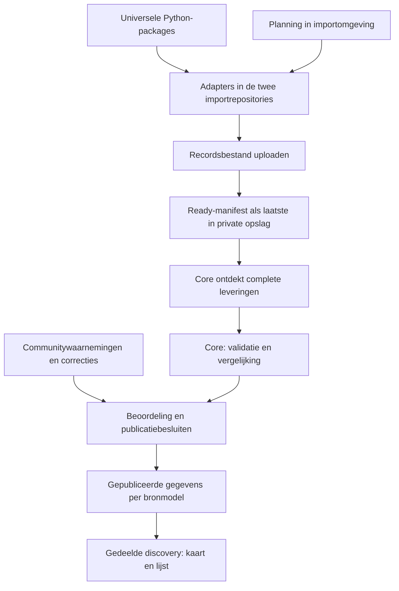

# Europese databasis voor NIPKaart

Status: overeengekomen richting met een voorgesteld technisch ontwerp; nog niet geïmplementeerd. Vastgelegd op 2026-09-08 naar aanleiding van de product- en architectuurgesprekken met de eigenaar. Technische defaults en open beslissingen zijn hieronder expliciet gemarkeerd. Dit document is geen bewijs van werkende imports, Europese dekking of productieacceptatie.

De gekozen uitvoering is een zelfstandige batchaanpak: importrepositories plannen het ophalen en publiceren complete bestanden; core ontdekt en verwerkt die leveringen. Dit vervangt het eerdere voorstel waarin core opdrachten aan workers uitdeelde.

## Leeswijzer

- Dit document beschrijft doel, verantwoordelijkheden, aangesloten datasets, hybride gegevens en productgrenzen.
- [Batchimportcontract](../development/data-import-contract.md) beschrijft versieerbare bestanden, gereedmelding, verwerking en herstel.
- [Uitvoering en beheer](../development/data-foundation-delivery.md) bevat werkpakketten, acceptatiecriteria, hosting, beveiliging, migratie en open beslissingen.
- [Concrete techstack](../development/data-foundation-stack.md) koppelt het ontwerp aan runtimes, libraries, opslag, authenticatie en deployment.
- [CONTEXT.md](../../CONTEXT.md) bevat de gedeelde begrippen. Bestaande modelnamen blijven gelden; nieuwe begrippen betekenen niet dat er al overeenkomstige modellen of tabellen bestaan.

## 1. Doel en aanleiding

NIPKaart helpt mensen bruikbare toegankelijke parkeerplekken vinden. Europese dekking is het ontwerpuitgangspunt. Werkelijke dekking wordt per gebied en dataset aangetoond; een Europese architectuur is geen belofte dat ieder land volledig wordt gedekt.

Kant-en-klare datasets zijn schaars, verschillen sterk en bevatten vaak onvoldoende informatie. De eigenaar heeft daarom naast het bouwen van Python-packages veel handmatig brononderzoek en kaartonderzoek gedaan en zelf plekken toegevoegd. NIPKaart moet de resulterende parkeerinformatie duurzaam vastleggen en door anderen laten aanvullen en onderhouden. Het onderzoeksproces zelf blijft buiten het platform.

De basis ondersteunt drie manieren van vergaren:

1. Gemeentelijke en andere datasets via herbruikbare bronpackages, API's en bestanden.
2. Handmatige aanlevering van gevonden plekken of verkregen bestanden, met hun relevante herkomst. Het voorafgaande onderzoek wordt buiten NIPKaart gedaan.
3. Communitybijdragen: nieuwe plekken, aanvullingen, bevestigingen, correcties en meldingen dat een plek verdwenen of tijdelijk onbruikbaar is.

Imports en communitywaarnemingen dragen samen bij aan wat NIPKaart toont. Een herimport mag lokale beoordelingen en correcties niet wissen. Herkomst, onzekerheid en actualiteit moeten voor gebruikers begrijpelijk blijven.

## 2. Bestaande situatie en grenzen

De volgende bevindingen zijn gebaseerd op de in deze sessie gelezen code en documentatie; de draaiende oude productieomgeving is niet onderzocht.

| Onderdeel | Bestaande situatie | Richting |
| --- | --- | --- |
| [Oude NIPKaart](https://github.com/klaasnicolaas/nipkaart) | Spotterbijdragen met beoordeling; afzonderlijke gemeentelijke en offstreetdata | Bron van productervaring, geen runtimebasis voor nieuwe imports |
| [Core](https://github.com/NIPKaart/core) | Laravel 13, PostgreSQL/PostGIS, aparte bronmodellen, communitybevestigingen, favorieten en gedeelde discoveryservice | Regie, beoordeling, publicatie en gebruikerservaring |
| [disabled-parking](https://github.com/NIPKaart/disabled-parking) | 15 stadsadapters; Python-packages en enkele directe downloads; oude MySQL-tabellen; eerst verwijderen en daarna uploaden | Gemeentelijke adapters en zelfstandig geplande batchuitvoering |
| [offstreet-parking](https://github.com/NIPKaart/offstreet-parking) | Amsterdam en Hamburg; packagegebruik, periodieke lus, directe MySQL-writes | Adapters en geplande levering voor voorzieningen en bezetting |
| Universele Python-packages | Gemeentespecifieke bronclients, bijvoorbeeld ODPAmsterdam en UDPHamburg | Zelfstandig bruikbaar houden, zonder NIPKaart-afhankelijkheid |

Bekende aandachtspunten uit de importcode: sommige identiteit is afgeleid van coördinaten, Den Haag gebruikt een limiet van 300 zonder paginering in de adapter, de gemeentelijke runner verwijdert bestaande stadsrecords vóór publicatie van vervangers en de Amsterdamse offstreetadapter zet ontbrekende aantallen om naar nul. Deze bevindingen rechtvaardigen gerichte tests; ze bewijzen geen huidige productiedatalekken of dataverlies.

De [bestaande PostgreSQL-afspraak](../development/postgresql.md#fresh-start-decision) is een nieuwe database. Er is geen opdracht om de gehele oude MySQL-database over te zetten. Nieuw opgebouwde bronidentiteit, communitygegevens en favorieten moeten vanaf de eerste nieuwe publicatie wel stabiel blijven.

## 3. Besluiten uit het gesprek

| Besluit | Consequentie |
| --- | --- |
| Europese dekking als uitgangspunt | Geen verplicht Nederlands CBS-nummer, postcodeformaat, provinciepatroon of telefooncode als identiteit |
| Universele packages blijven een zelfstandig open-dataproduct | Geen NIPKaart-publicatiestatus, database-ID's, importcredentials of businessregels in die packages |
| Adapters en batchuitvoering horen in de twee importrepositories | NIPKaart-vertaling en ophaalplanning gebeuren buiten de universele packages |
| Het bestandcontract scheidt verzamelen en verwerken | Importomgeving plant fetches; core ontdekt complete leveringen en beheert publicatie |
| Brononderzoek blijft buiten het platform | Alleen operationeel datasetbeheer; geen CRM, leads, contacthistorie of onderzoeksworkflow |
| Python levert bestanden, core publiceert parkeerinformatie | Beperkte opslagrechten voor producenten; geen coretoken of databaseverbinding |
| Datasets en communitykennis zijn beide nodig | Correcties op geïmporteerde plekken horen bij de basis |
| Code mag open zijn, de operatie is gecontroleerd | Private opslag, gescheiden producent-/consumerrechten en beheerde bulktoegang |
| Mobiel is een toekomstige productrichting | Verwerking centraal en herbruikbaar; geen mobiele app bouwen in deze eerste oplevering |
| Vertrouwen kan later verwerking versnellen | Nu onderbouwde bijdrage- en beslisgeschiedenis verzamelen; nog geen automatische karmadrempels |

De batchgrens is gekozen. Exacte manifestvelden, termijnen en infrastructuurdetails blijven ontwerpvoorstellen. Werkpakket A valideert en bevriest het eerste bestandcontract voordat productiecode erop vertrouwt.

## 4. Verantwoordelijkheden

| Laag | Verantwoordelijk voor | Niet verantwoordelijk voor |
| --- | --- | --- |
| Universeel package | Bronprotocol, pagina's ophalen, bronobjecten en bronfouten | NIPKaart-identiteit, moderatie of distributiebeleid |
| NIPKaart-adapter | Veldbetekenis vertalen, bron-ID behouden, filterscope en volledigheid rapporteren | Gemeentelijke bronwaarden stilzwijgend vervangen door lokale correcties |
| Python-batchrunner | Eigen sourceplanning, begrensd ophalen, bestanden uploaden, als laatste gereedmelden en fetchfouten melden | Core aanroepen om werk te claimen of parkeerinformatie publiceren |
| Core | Toegelaten datasets, manifestdiscovery, importhistorie, validatie, beoordeling, publicatie en uitblijvende leveringen signaleren | Bronfetches plannen, broncredentials beheren of onderzoeksworkflow aanbieden |
| Beheerder | Bron toelaten, uitzonderingen beoordelen, voorwaarden en kwaliteit vastleggen | Iedere normale herimport handmatig overtypen |

Er zijn twee verschillende soorten achtergrondwerk: Python verzamelt brondata; Laravel verwerkt aanleveringen en besluiten. Python leest geen Laravel-queuetabellen en krijgt geen databasecredentials.

Core beheert het versieerbare bestandcontract en voorbeelden; beide importrepositories testen tegen dezelfde release. Gedeelde Python-uitvoeringslogica wordt pas losgetrokken wanneer een tweede repository die werkelijk nodig heeft. De universele bronclients blijven daarvan onafhankelijk.

## 5. Aangesloten datasets beheren

Onderzoek naar mogelijke bronnen, contact met gemeenten en onderzoeksnotities blijven buiten NIPKaart. De eigenaar heeft expliciet aangegeven geen CRM of leadbeheer te willen bouwen. Deze documentatie schrijft daarvoor ook geen ander hulpmiddel voor.

Een dataset wordt in core geregistreerd zodra we deze aansluiten. Het beheer bevat aanbieder/titel, herkomst-URL, gebied, datacategorie, toegelaten opslagprefix/scope, voorwaarden/attributie, verwachte leveringsleeftijd en import-/publicatiestatus. Adapterinstellingen, broncredentials en fetchplanning staan in de importomgeving. Coretoestanden `configured`, `active`, `paused` en `retired` betreffen verwerking, niet het stopzetten van de externe runner. Een eerste proefimport hoort bij aansluiting.

Beantwoord bij het voorbereiden van een aansluiting buiten het platform de volgende vragen en neem de operationeel relevante uitkomst in de datasetconfiguratie over:

- inhoud: algemene toegankelijke parkeerplekken, persoonsgebonden plekken, garages/P+R of livebezetting;
- werkelijk gedekt gebied en uitsluitingen, niet alleen de naam van de gemeente;
- stabiele bron-ID's, wijzigingen, verwijderingen, paginering en brondatums;
- geometrie, coördinatenstelsel, aantallen, toegang en tijdsbeperkingen;
- actualiteit en verantwoordelijke bronhouder;
- licentie, attributie, opslag en hergebruik, inclusief eventuele bronvoorwaarden;
- technische toegang, snelheidslimieten, onderhoudskosten en bestaand universeel package.

Een bronhouder kan meerdere datasets leveren; een dataset kan meerdere gebieden bedienen; hetzelfde gebied kan meerdere datasets hebben. Landen/regio's zijn interne referenties met lokale benamingen en externe codes als optionele mappings. Een adapter hardcodet geen interne country/province-ID's. Werkpakket B definieert hoe onbekende buitenlandse administratieve niveaus naar de huidige verplichte geografische relaties worden vertaald; maak geen fictieve provincies zonder expliciete mappingbeslissing.

De bestaande Nederlandse, Belgische en Duitse adapters zijn kandidaten voor een gevarieerde pilot. Geen daarvan is automatisch geselecteerd of productieklaar. Landelijke registers zoals [RDW/NPR](https://www.nationaalparkeerregister.nl/open-parkeerdata), gemeentelijke portalen en eventueel [OpenStreetMap](https://www.openstreetmap.org/copyright) worden buiten het platform inhoudelijk en qua voorwaarden beoordeeld. Dekking in NIPKaart beschrijft aangesloten datasets en communitygegevens, niet een onderzoeksinventaris van alle Europese gemeenten.

## 6. Hybride gegevens en identiteit

### 6.1 Bronrecords en fysieke plekken

`ParkingSpace`, `ParkingMunicipal` en `ParkingOffstreet` blijven afzonderlijke modellen en tabellen. Een bronrecord zegt wat één bron over een plek of voorziening meldt; het is niet vanzelf het volledige beeld van de fysieke plek.

De basis voegt herkomst en koppelingen toe zonder deze modellen samen te voegen. Een koppeling verwijst naar een expliciet type en een bestaande ID. Een gemeentelijk punt en een communityplek kunnen na beoordeling dezelfde fysieke plek beschrijven. Een garage en een gehandicaptenvak binnen die garage hebben eerder een containmentrelatie dan een identiteitsovereenkomst.

Elke bronrecordidentiteit is uniek binnen `(dataset, external_id)`. Externe ID's zijn ondoorzichtige strings; behoud voorloopnullen en de volledige waarde. Een coördinatenwijziging verandert de interne ID niet. Ontbrekende stabiele bron-ID's vereisen een expliciete, geteste strategie voor die adapter en beoordeling van onzekere matches; een afgeronde coördinatenhash is geen universele oplossing.

De eerste pilot maakt nieuwe bronrecords aan of koppelt ze aan een bestaande bronidentiteit. Mogelijke matches met andere bronnen/community worden voorgesteld, niet automatisch samengevoegd. Beoordeelde koppelingen hebben een actor, datum, reden en ontkoppelgeschiedenis. Discovery mag pas dubbelen onderdrukken zodra broninformatie en bestaande favoriet/detailverwijzingen behouden blijven. Die UI-wijziging heeft eigen acceptatie onder #1170/#1172.

### 6.2 Waarnemingen en correcties

Een communitywaarneming beschrijft welke eigenschap iemand heeft vastgesteld, hoe en wanneer. Onderscheid veldbezoek, toegestane beeldbron, document of andere bron. Vandaag ingevoerd is niet hetzelfde als vandaag waargenomen. Bij ouder beeldmateriaal blijft de beelddatum apart van de registratiedatum, met onbekende datum expliciet toegestaan.

Een correctievoorstel bevat doeltype/ID, gewijzigde velden, eerdere waarden of de versie waarop het voorstel is gebaseerd, voorgestelde waarden, reden, waarnemingsdatum en onderbouwing. Correcties mogen op geïmporteerde plekken worden aangebracht zonder een nieuwe dubbele communityplek te creëren.

Een beoordeling accepteert, verwerpt of vraagt meer informatie en bewaart wie wat op welke onderbouwing besliste. De huidige publicatie-/bevestigingsstatussen worden hergebruikt waar hun betekenis overeenkomt; een voorstelstatus wordt geen tweede concurrerende status van een parkeerplek.

Voor de eerste versie geldt een expliciete veldkeuze: een actieve, goedgekeurde lokale correctie gaat voor de actuele bronwaarde van dat veld. Core bewaart beide. Een nieuwe afwijkende bronwaarde heropent een conflict voor beoordeling maar wist de correctie niet. Wanneer een correctie wordt ingetrokken, wordt de laatste geldige bronwaarde weer de basis. Een verlopen of betwiste correctie vraagt herbeoordeling; automatisch terugvallen vereist later een expliciet beleid.

Voorbeeld: een bron meldt twee vakken, een beoordeelde waarneming corrigeert dat naar één. Een nieuwe import met twee vakken houdt bronwaarde twee en gepubliceerde waarde één vast en registreert het conflict. Als de bron later ook één meldt, kan het conflict vervallen; de correctiegeschiedenis blijft bestaan.

### 6.3 Actualiteit en verdwenen plekken

Bewaar afzonderlijk: wanneer opgehaald, welke datum/versie de bron vermeldt, wanneer iets is waargenomen, wanneer beoordeeld en wanneer gepubliceerd. Een geslaagde import vernieuwt niet automatisch de waarnemingsdatum van ieder record.

Een ontbrekend record uit een aantoonbaar volledige snapshot wordt `missing_from_source`, met datum en importreferentie. In de pilot leidt dit tot beoordeling. Het verdwijnen uit een delta, mislukte import of livebezettingsbatch heeft die betekenis niet. Een afgeronde beoordeling kan de plek als niet beschikbaar publiceren zonder de identiteit en favorieten te vernietigen. Herintroductie behoudt de identiteit en volgt opnieuw het publicatiebeleid.

Actualiteit wordt per informatietype beoordeeld. Een verouderde bezettingsmeting maakt alleen de livebeschikbaarheid onbekend; zij verwijdert geen garage. Algemene vrije capaciteit, toegankelijke capaciteit en toegankelijke vrije plaatsen zijn afzonderlijke gegevens. Onbekend is nooit nul.

## 7. Beheer- en gebruikersflows

### Bron aansluiten

1. Selecteer buiten het platform een geschikte dataset en registreer de aansluiting met inhoud, herkomst en voorwaarden.
2. Configureer package/adapter, scope en ophaalritme in de importrepo; leg in core de toegelaten levering en verwachte maximale leeftijd vast.
3. Produceer een proefbestand en laat core dat valideren zonder publicatie.
4. Bekijk aantallen, kaartsteekproef, afwijkingen, voorwaarden en mogelijke dubbelen.
5. Beoordeel de eerste publicatie; stel daarna een automatisch beleid binnen vastgelegde controles in.

### Terugkerende import

De importomgeving haalt volgens eigen planning op en schrijft pas na volledige bestandsupload een ready-manifest. Core ontdekt dit, valideert en vergelijkt. Normale wijzigingen mogen na pilotacceptatie automatisch publiceren; afwijkingen komen in de beoordelingslijst. Core toont uitblijvende leveringen als achterstand en houdt ontvangst, validatie en publicatie apart. De oorzaak van een fetchfout staat in de importomgeving. Ophalen pauzeren en corepublicatie pauzeren zijn afzonderlijke handelingen.

### Bijdragen en onderhouden

Een gebruiker kan een plek toevoegen of op een bestaande plek een concrete correctie indienen. Het formulier vraagt alleen relevante informatie en maakt onbekende waarden mogelijk. Bevestigen moet duidelijk maken wat wordt bevestigd. Beheerders krijgen een vergelijkbare oude/nieuwe weergave, herkomst en reden, met een toegankelijk alternatief voor kaartinteractie.

Gerichte onderhoudstaken richten zich op oude waarnemingen, conflicten en ontbrekende dekking. Start met een beheerfilter en vrijwillige bevestigingsflow. Locatiegerichte pushberichten of tracking van gebruikers horen niet bij deze basis.

Publieke resultaten tonen bruikbare herkomst, relevante datum en tekstuele onzekerheid. Interne configuratie, credentials en onbewerkte payloads worden niet doorgegeven. Basiszoeken blijft zonder account beschikbaar en alle essentiële taken hebben een toetsenbordbruikbare lijst/detailflow.

## 8. Vertrouwen en mobiele toekomst

Het door de eigenaar genoemde Flitsmeister-voorbeeld is inspiratie; de precieze werking daarvan is hier niet onderzocht of als specificatie overgenomen.

De basis registreert bijdragen, onafhankelijke bevestigingen, beoordelingen en teruggedraaide besluiten. Later kan aantoonbaar betrouwbare bijdragegeschiedenis helpen bij het prioriteren of automatisch verwerken van laag-risicowijzigingen. Veel indienen, zelfbevestiging of eerder automatisch accepteren is geen onafhankelijk bewijs van juistheid. Voorkom een feedbacklus waarin automatische acceptatie direct nieuw vertrouwen oplevert.

Vertrouwen in een persoon verschilt van zekerheid over een specifieke eigenschap. Een melding dat een plek verdwenen is vraagt een ander beleid dan een kleine beschrijvingscorrectie. Drempels, misbruikdetectie, bezwaar en verval worden pas ingevoerd nadat de handmatige flow voldoende beoordeelde voorbeelden heeft. Geen publieke ranglijst of karmascore in de eerste oplevering.

Een toekomstige mobiele app gebruikt dezelfde toepassingsregels voor bijdragen, beoordeling en lezen. Het batchcontract is geen mobiele API. Mobiele authenticatie, offlinebijdragen, GPS, camera en notificaties worden afzonderlijk ontworpen; vandaag bouwen we een telefoonbruikbare webflow en herbruikbare toepassingslogica.

## 9. Open code en beschermde dienstverlening

De universele bronpackages blijven onafhankelijk bruikbaar. Ook adapter- en corecode mogen open blijven volgens hun gekozen licenties. Open code geeft geen toegang tot de beheerde installatie, workers, opgeslagen bronbestanden of private operationele gegevens. Onderzoeksgegevens worden buiten het platform beheerd.

De waarde van NIPKaart ontstaat uit doorlopend onderzoek, beoordeelde koppelingen, actuele correcties, operationele betrouwbaarheid en community. Toegang tot samengestelde bulkdata is een afzonderlijke productkeuze. Rate limits en querygrenzen beperken misbruik maar garanderen niet dat zichtbare kaartinformatie niet verzameld wordt.

Voorwaarden verschillen per bron. [OpenStreetMap](https://www.openstreetmap.org/copyright) gebruikt ODbL met attributie- en share-alikevoorwaarden; veronderstel daarom niet dat iedere samengestelde dataset exclusief kan blijven. De [Google Maps-voorwaarden](https://www.google.com/intl/en-US/help/terms_maps/) bevatten beperkingen op het hergebruiken van kaartinhoud en het opbouwen van andere kaartdatasets. De geschiktheid van Street View als structurele gegevensbron moet vóór integratie specifiek worden beoordeeld. Deze architectuur geeft daarvoor geen hergebruiktoestemming. De geraadpleegde voorwaarden zijn gecontroleerd op 2026-09-08; bewaar per bron de toepasselijke versie en toegestane handelingen.

Leg voor iedere bron apart vast of ophalen, ruwe opslag, normalisatie, publieke weergave en bulkherdistributie zijn toegestaan, met vereiste attributie. Voor communitybijdragen moeten gebruiksrechten en bewaarbeleid nog worden vastgesteld. Dat zijn lanceerbeslissingen, geen impliciete gevolgen van een code-licentie.

## 10. Eerste resultaat en volgorde

Eenvoud is leidend: [de startscope](../development/data-foundation-delivery.md#eenvoud-als-uitgangspunt-voor-uitvoering) splitst de eerste keten in bestandverwerking, automatisering en correctiebehoud. Begin met één bron en expliciete adaptermapping; bouw gedeelde abstracties pas wanneer een tweede bron daar aanleiding toe geeft. De technische uitwerking beschrijft ook latere mogelijkheden en is geen opdracht om alle onderdelen vooraf te bouwen.

Het eerste resultaat is een volledige keten met één bestaand Python-package: bron toelaten, zelfstandig ophalen, bestand gereedmelden, ontdekken, beoordelen en publiceren, een communitycorrectie accepteren en veilig herimporteren. Onderbroken uploads, core-uitval, dubbele leveringen en laat binnenkomende oudere batches moeten diezelfde keten doorstaan.

Daarna volgen een inhoudelijk afwijkende gemeentelijke bron uit een ander land, een offstreetvoorzieningenbron en een aparte bezettingsstroom. Generieke CSV/GeoJSON-upload sluit vervolgens aan op dezelfde verwerking. Een generieke adapterbouwer, continentbrede bronselectie, publieke bulk-API, automatische karma en mobiele app zijn geen voorwaarden voor deze eerste keten.

Deze keuze haalt het noodzakelijke bronregister, importhistorie en correctiebehoud naar de eerste databasis. Zij verfijnt de eerdere Horizon 2-indeling in de [feature-inventaris](feature-inventory.md); bestemmingzoeken en toegankelijkheid blijven productdoelen. Werkpakketten en toetsbare criteria staan in het [uitvoeringsplan](../development/data-foundation-delivery.md).
